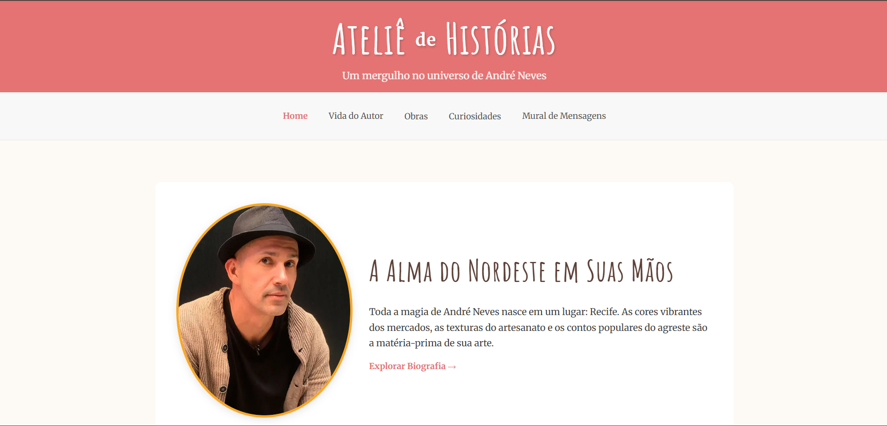

# Ateliê de Histórias - Um Mergulho no Universo de André Neves

## Sobre o Projeto

O "Ateliê de Histórias" é um blog interativo e imersivo, totalmente dedicado a celebrar a vida e a obra do talentoso escritor e ilustrador brasileiro André Neves. Este projeto foi criado como uma homenagem, buscando oferecer um espaço digital que capture a essência mágica e a profundidade artística de suas criações.

Aqui, os visitantes podem explorar desde a biografia do autor, mergulhando em suas raízes nordestinas que tanto influenciam sua arte, até uma galeria detalhada de suas obras, com sinopses, temas e análises sobre suas ilustrações únicas.

## Imagem do Site

## 🚀 Funcionalidades

O projeto foi desenvolvido com diversas seções interativas para proporcionar a melhor experiência aos fãs de André Neves:

* **🏠 Home:** Uma página inicial que introduz o visitante ao universo do autor.
* **👤 Biografia do Autor:** Uma página dedicada à trajetória de André Neves, suas inspirações e prêmios.
* **📚 Galeria de Obras:** Uma seção completa com as capas e detalhes dos livros, onde cada obra possui sua própria página com sinopse e análise da ilustração.
* **🎨 Artigos e Análises:** Artigos que exploram as técnicas de colagem, o uso das cores e as mensagens profundas presentes nas histórias.
* **✨ Quiz Interativo:** Uma divertida ferramenta para que os leitores descubram com qual personagem do universo de André Neves eles mais se parecem.
* **📌 Mural de Mensagens:** Um espaço para que os visitantes possam deixar seus recados e compartilhar seu carinho pelo autor e suas obras.
* **💡 Curiosidades:** Uma seção com fatos interessantes sobre o processo criativo e os segredos por trás das histórias.

## 🛠️ Tecnologias Utilizadas

Este projeto foi construído com tecnologias modernas para garantir uma experiência de usuário fluida e agradável:

* **Next.js:** Para uma renderização otimizada e navegação rápida.
* **React:** Para a construção de interfaces de usuário dinâmicas e interativas.
* **TypeScript:** Para um desenvolvimento mais seguro e robusto.
* **PostgreSQL:** Utilizado no backend para o funcionamento do Mural de Mensagens.
* **Vercel:** Para o deploy e hospedagem do projeto.
* **Font Awesome:** Para a utilização de ícones nas redes sociais.

## ⚙️ Como Executar o Projeto

Para acessar o site só seguir o link abaixo:

1.https://blog-nextjs-coral-psi.vercel.app/

## ✍️ Autores

Este blog foi idealizado e desenvolvido por:

* **Thimótio Jeronimo:** [GitHub](https://github.com/thimo08)
